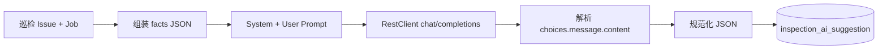

# Spring Boot 架构巡检首次接入大模型：硅基流动 + OpenAI 兼容协议实战

> **摘要**：在既有「架构巡检 → 问题落库」链路中，第一次引入大模型能力：对单条 issue 做「解读 + 修复建议」，要求输出可解析的结构化 JSON 并落库可追溯。本文记录选型、配置、HTTP 客户端、Prompt 约束与踩坑，便于同类业务快速复用。

**工程**：`ArchitectureGovernance` · Spring Boot 4.x · Java 17 · MyBatis-Plus

---

## 一、业务目标与整体思路

- **输入**：数据库中的巡检问题（`InspectionIssue`）及关联任务（`InspectionJob`）上的事实字段。
- **输出**：固定 schema 的 JSON（摘要、影响、可能原因、分步行动、待人工确认问题、置信度）。
- **工程要求**：不绑死某一云厂商，采用 **OpenAI 兼容** 的 `POST /v1/chat/completions`；默认对接 **硅基流动国内站**；支持 **演示模式**（不调外网）；支持 **可选 HTTP 代理**（接境外 API 时使用）。

### 数据流



---

## 二、依赖与配置

### 2.1 依赖

使用 `spring-boot-starter-web` 即可使用 Spring 6 的 `RestClient`（具体版本以项目 `pom.xml` 为准）。

### 2.2 硅基流动对接要点

参考硅基流动文档：[在 Kilo Code 中配置硅基流动](https://docs.siliconflow.cn/cn/usercases/use-siliconcloud-in-KiloCode)。

| 项 | 说明 |
|----|------|
| Base URL | 须包含 **`/v1`**，例如 `https://api.siliconflow.cn/v1` |
| API Key | 控制台密钥；**中文站与国际站账号不互通** |
| 模型 | 模型广场完整名称，如 `Qwen/Qwen2.5-7B-Instruct` |

### 2.3 `application.yml` 核心片段

```yaml
inspection:
  ai:
    enabled: true
    demo-mode: false
    base-url: https://api.siliconflow.cn/v1
    chat-path: /chat/completions
    api-key: ${SILICONFLOW_API_KEY:${INSPECTION_AI_API_KEY:}}
    model: Qwen/Qwen2.5-7B-Instruct
    temperature: 0.3
    connect-timeout-ms: 20000
    read-timeout-ms: 180000
    json-object-response-format: true
    proxy-host: ""
    proxy-port: 0
```

- **`json-object-response-format`**：为 `true` 时在请求体中携带 `response_format: { "type": "json_object" }`。若网关返回 400，可改为 `false` 并在 Prompt 中强调仅输出 JSON。
- **代理**：国内直连 `.cn` 通常留空；改接 OpenAI 等境外地址时配置 `proxy-host` / `proxy-port`（如 `127.0.0.1` / `7890`）。

### 2.4 演示模式

使用 **`spring.profiles.active=demo`** 加载 `application-demo.yml`，并将其中 **`inspection.ai.demo-mode` 设为 `true`**，服务将使用本地拼接的 JSON 模拟大模型结果（实现见 `AiIssueAssistantService.buildDemoOutputJson`），无需外网与密钥。

### 2.5 Profile：`siliconflow`

`application-siliconflow.yml` 可与主配置合并，用于脚本或文档中统一写 `profiles=siliconflow` 启动；字段与主配置应对齐。

---

## 三、HTTP 客户端：RestClient + 可选代理

使用独立命名的 `RestClient.Builder` Bean（`aiRestClientBuilder`），避免与业务其他 HTTP 客户端混用。

需要代理时：使用 **`java.net.http.HttpClient` + `ProxySelector` + `JdkClientHttpRequestFactory`**，HTTPS 经 HTTP 代理走 CONNECT。

```java
@Configuration
@EnableConfigurationProperties(AiProperties.class)
public class AiClientConfig {

    @Bean(name = "aiRestClientBuilder")
    public RestClient.Builder aiRestClientBuilder(AiProperties properties) {
        return RestClient.builder()
                .requestFactory(buildRequestFactory(properties))
                .baseUrl(trimTrailingSlash(properties.getBaseUrl()));
    }

    private static ClientHttpRequestFactory buildRequestFactory(AiProperties p) {
        Duration connect = Duration.ofMillis(p.getConnectTimeoutMs());
        Duration read = Duration.ofMillis(p.getReadTimeoutMs());
        String host = p.getProxyHost();
        if (host != null && !host.isBlank() && p.getProxyPort() > 0) {
            String proxyHost = java.util.Objects.requireNonNull(host).trim();
            HttpClient httpClient = HttpClient.newBuilder()
                    .connectTimeout(connect)
                    .proxy(ProxySelector.of(new InetSocketAddress(proxyHost, p.getProxyPort())))
                    .build();
            JdkClientHttpRequestFactory factory = new JdkClientHttpRequestFactory(httpClient);
            factory.setReadTimeout(read);
            return factory;
        }
        SimpleClientHttpRequestFactory simple = new SimpleClientHttpRequestFactory();
        simple.setConnectTimeout(connect);
        simple.setReadTimeout(read);
        return simple;
    }

    private static String trimTrailingSlash(String url) {
        if (url == null || url.isEmpty()) {
            return url;
        }
        return url.endsWith("/") ? url.substring(0, url.length() - 1) : url;
    }
}
```

**调用封装**（`OpenAiChatClient`）：对配置的 `chat-path` 发起 POST，设置 `Authorization: Bearer <api-key>` 与 `Content-Type: application/json`。

```java
@Component
public class OpenAiChatClient {

    public String chatCompletions(String requestBodyJson) {
        String path = normalizePath(properties.getChatPath());
        return restClientBuilder.build()
                .post()
                .uri(path)
                .header("Authorization", "Bearer " + properties.getApiKey())
                .header("Content-Type", "application/json")
                .body(requestBodyJson)
                .retrieve()
                .body(String.class);
    }

    private static String normalizePath(String p) {
        if (p == null || p.isEmpty()) {
            return "/chat/completions";
        }
        return p.startsWith("/") ? p : "/" + p;
    }
}
```

源码路径：`src/main/java/org/example/inspect/config/AiClientConfig.java`、`.../ai/OpenAiChatClient.java`。

---

## 四、业务核心：Prompt、请求体、解析与落库

### 4.1 System Prompt

在 `AiIssueAssistantService` 中通过常量 **SYSTEM_PROMPT** 约定：

- 仅根据「事实 JSON」与用户补充作答，禁止编造事实中不存在的字段；
- 输出单个 JSON 对象（不要 Markdown 代码块）；
- 字段：`summary`、`why_it_matters`、`likely_causes`、`recommended_actions`（含 `step` / `action` / `owner_hint`）、`questions_for_humans`、`confidence`；
- 使用简体中文。

### 4.2 事实与用户载荷

- `buildFacts`：将 `InspectionIssue` 与可选的 `InspectionJob` 转为 JSON。
- `buildUserPayload`：拼接「事实 JSON」与「用户补充说明」。

### 4.3 请求体（OpenAI 兼容）

```java
JSONObject request = new JSONObject();
request.put("model", aiProperties.getModel());
request.put("temperature", aiProperties.getTemperature());
// messages: system = SYSTEM_PROMPT, user = userContent
request.put("messages", messages);
if (aiProperties.isJsonObjectResponseFormat()) {
    JSONObject fmt = new JSONObject();
    fmt.put("type", "json_object");
    request.put("response_format", fmt);
}
String httpResponse = chatClient.chatCompletions(request.toJSONString());
```

### 4.4 响应处理

- `extractAssistantContent`：从 `choices[0].message.content` 读取助手正文。
- `normalizeToJsonObjectString`：去除可能的 \`\`\`json 围栏后解析；失败则写入带 `parse_error` 的兜底 JSON，避免整条链路失败。

### 4.5 落库与 REST API

- 表/实体：`AiSuggestion`（如 `kind = EXPLAIN_FIX`，保存 `outputJson`、`durationMs`、哈希等）。
- **生成**：`POST /inspection/issues/{issueId}/ai/suggest`（请求体可选 `userNote`）。
- **查询最新**：`GET /inspection/issues/{issueId}/ai/latest?kind=EXPLAIN_FIX`。

控制器：`IssueAiController`。

---

## 五、输出示例（字段含义）

成功时 `outputJson` 为字符串形式的 JSON，解析后典型字段：

| 字段 | 含义 |
|------|------|
| `summary` | 一句话结论 |
| `why_it_matters` | 为何重要（数组） |
| `likely_causes` | 可能原因（数组，带不确定性表述） |
| `recommended_actions` | 分步行动与 `owner_hint` |
| `questions_for_humans` | 需人工确认的问题 |
| `confidence` | `high` / `medium` / `low` |

前端可对 `outputJson` 二次反序列化后绑定 UI。

---

## 六、踩坑与经验

1. **连接超时**：直连境外域名在国内易超时；接 OpenAI 需代理或改用国内可访问的 Base URL（如硅基流动 `.cn`）。
2. **401 / invalid_api_key**：密钥必须与 **Base URL 所属平台** 一致；勿将 A 平台密钥用于 B 平台域名。
3. **`response_format`**：部分兼容网关不支持 `json_object`，需关闭配置并加强 Prompt。
4. **可观测性**：记录 `durationMs`、截断后的原始回复，便于排障（注意脱敏与长度）。
5. **安全**：API Key 仅通过环境变量或密钥管理注入，勿提交仓库。

---

## 七、小结

用 **OpenAI 兼容协议** 统一对接硅基流动及其他兼容网关；用 **强约束 Prompt + 可选 `response_format` + 解析兜底** 保证结构化落地；用 **独立 `RestClient` Bean + `ConfigurationProperties`** 保持配置清晰。适合作为「规则引擎 + LLM 解读」第一期的工程模板。

---

## 附录：相关源码路径

| 内容 | 路径 |
|------|------|
| AI 配置属性 | `src/main/java/org/example/inspect/config/AiProperties.java` |
| RestClient 与代理 | `src/main/java/org/example/inspect/config/AiClientConfig.java` |
| Chat Completions 调用 | `src/main/java/org/example/inspect/ai/OpenAiChatClient.java` |
| 业务与 Prompt | `src/main/java/org/example/inspect/service/AiIssueAssistantService.java` |
| REST API | `src/main/java/org/example/inspect/controller/IssueAiController.java` |
| 主配置 | `src/main/resources/application.yml` |
| 演示 / 硅基流动 Profile | `application-demo.yml`、`application-siliconflow.yml` |
